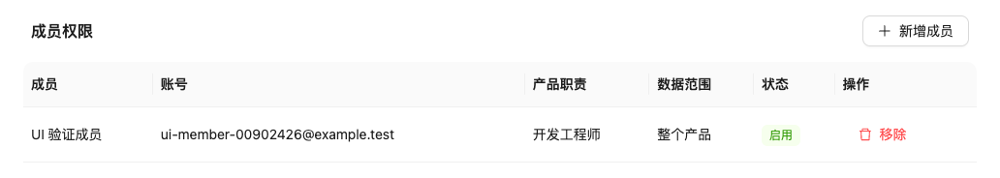
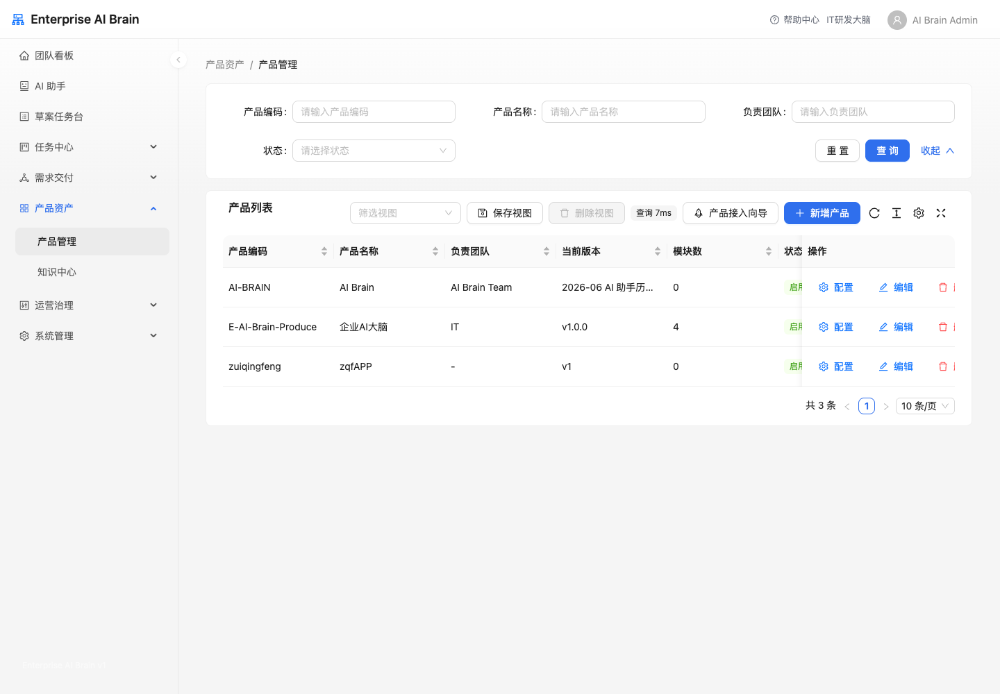

# 产品资产与知识中心

## 产品管理

产品管理是 AI Brain 数据归属的基础。需求、研发任务、Bug、知识文档、代码巡检和看板指标都会依赖产品范围。

可维护内容：

- 产品基础信息。
- 迭代版本。
- 产品模块。
- Git 仓库和项目路径。
- 相关系统。
- 成员权限，包括产品经理、研发负责人、开发、测试、运维/发布和观察者。

viewer 可以只读查看产品资产，但不能新增、编辑或删除。

### 成员权限

在产品列表点击“配置”后，可以在弹窗中的“成员权限”区域维护当前产品的协作人员。成员权限用于决定用户能看到和操作哪些产品数据，系统角色仍用于决定用户具备哪些功能能力。

1. 有成员查看权限时，可以查看产品成员、账号、产品职责、数据范围和状态。
2. 有成员管理权限时，可以点击“新增成员”，选择系统用户和产品职责后保存。
3. 移除成员后，该用户会失去当前产品派生的数据范围；再次进入需求、Bug、研发任务或知识等页面时，只能看到仍被授权的产品数据。
4. 产品经理等产品负责人可以维护自己负责产品的成员；系统管理员仍可维护全部产品。

产品成员职责使用中文名称展示。若页面看不到“成员权限”或“新增成员”，通常表示当前账号只有产品只读权限，或没有该产品的成员管理范围。

### 产品接入向导

产品管理页提供“产品接入向导”，用于把新产品接入所需的配置串成一条检查路径：

1. 建立产品主数据：创建产品编码、产品名称、负责团队和默认版本。
2. 补齐交付结构和代码资源：维护迭代版本、业务模块、Git 资源和相关系统。
3. 绑定知识空间：为产品建立知识空间、目录和文档归属。
4. 配置插件连接：安装并配置钉钉 MCP、代码仓库或内部数据源等连接。
5. 校验角色与产品范围：确认用户角色具备正确的产品范围，避免菜单可见但接口无权。
6. 复检平台运行状态：进入系统健康页查看产品初始化、知识质量、插件连接和权限诊断结果。

只读用户可以查看接入步骤和当前配置状态，但不会看到新增或编辑入口。

## 知识中心

知识中心用于上传和治理产品知识，支持空间目录、文件解析、Hybrid Search、RAG 问答、引用展示和知识沉淀。

### 工作台结构

- 空间目录：组织知识归属，新文档和沉淀入库必须选择知识空间。
- 文档库：上传、筛选、查看索引状态和打开文档详情。
- 知识问答：基于 Hybrid Search 召回内容，并生成带引用的回答。
- 治理区：查看索引健康、导入任务、沉淀审核和重试入口。

### 上传文档

1. 选择知识空间和目录。
2. 上传文件并填写标题、文档类型、权限角色等信息。
3. 系统进行文件校验、解析、分块、关键词索引和向量索引。
4. 索引完成后可在文档库检索或在 RAG 问答中引用。

上传失败时，先检查文件大小、扩展名、MIME 类型、PDF 文件签名、知识空间归属和导入任务状态。

### 检索与 RAG

Hybrid Search 会在同一权限过滤下同时执行向量召回和关键词召回，再通过 RRF 融合排序。这样既能匹配语义相近内容，也能保留错误码、字段名、接口名、版本号等精确关键词。

RAG 问答会基于检索结果生成答案，并展示引用片段。引用不足或结果为空时，应补充知识文档、调整关键词或确认当前角色是否有空间访问权限。

回答生成后，可以点击“引用来源”中的文档片段记录引用点击，也可以点击“有用”或“无用”提交本次回答反馈。这些操作会进入知识质量闭环，用于统计引用点击率、有用/无用反馈和 RAG 引用准确率 proxy，帮助管理员识别低质量、过期或缺失的知识内容。
