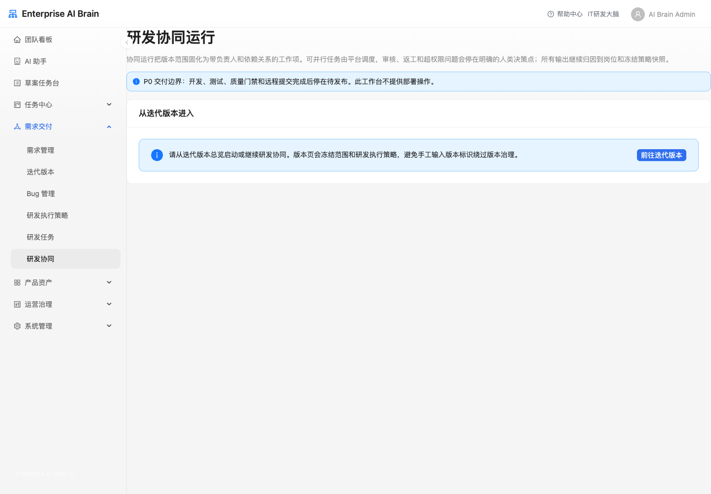
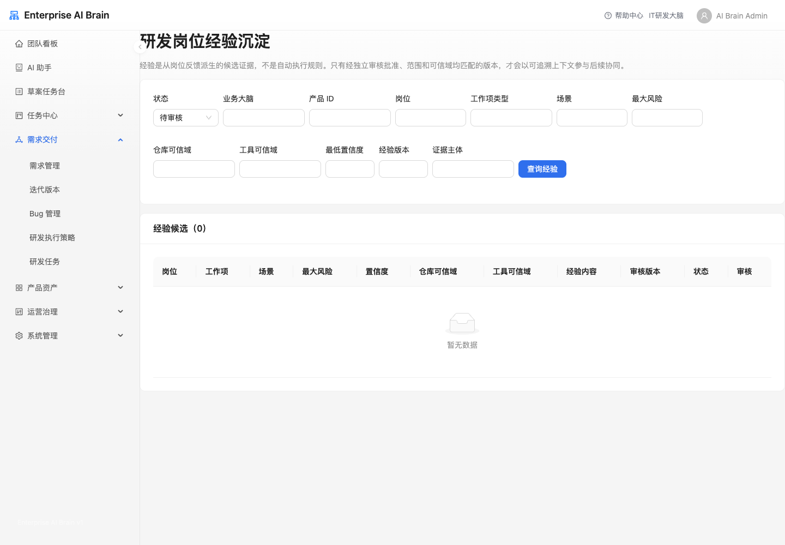

# 需求交付

## 需求管理

需求管理用于登记、审批、关闭需求，是协作研发的正式入口。研发需求会在后续评估、版本归集和协作编排中生成相应工作项；不能绕过该入口直接创建 v2 AI 研发任务。

### 核心流程

1. 创建需求并选择产品、优先级和负责人，补充背景、业务目标、验收标准和关联材料。
2. 提交审批后，在需求列表选择“研发评估”。平台会冻结需求修订和当前统一研发策略，收集产品、研发、测试等岗位意见。
3. 缺少信息时补充评估信息；遇到高风险、冲突、策略收紧不一致或超权限问题时，按页面中的人工决策处理。
4. 评估通过后，平台优先归入兼容的规划中版本；没有合适版本时才创建新版本。
5. 从版本发起研发协作，由工作项 DAG、岗位负责人、依赖、审核和返工状态机推进交付。
6. 通过“全链路”查看需求、评估、版本、工作项、Bug、知识和审计之间的关系。

viewer 只能查看授权产品范围内的需求，不能创建、审批、关闭或生成任务。

## 研发任务

研发任务用于跟踪 AI Task 的执行状态、Agent 自治循环、独立质量门禁、人工确认点和写回结果。属于 v2 协作运行的任务会显示在列表中供查看，但启动、重试、取消和批量操作必须由协作流程的工作项或人工决策处理，不能在任务中心直接旁路操作。

常见状态：

- `running`：AI 正在执行。
- `waiting_review`：等待人工确认。
- `waiting_more_info`：需要补充上下文。
- `completed`：任务完成。
- `failed`：执行失败，需要查看执行诊断。

任务详情中优先查看输出摘要、确认点、执行诊断，以及“自治循环”“质量门禁”“执行上下文”页签：

- 自治循环按轮次展示计划、代码执行、验证结论、失败分析、预算消耗和停止原因。循环运行中可点击“人工接管”，平台会停止继续派发下一轮并保留当前证据。
- 质量门禁展示单元测试、类型检查、静态/凭据/依赖扫描、CI、变更范围和高风险路径等独立检查。编码 Runner 返回成功不等于门禁通过；自动合入还要求由不同信任边界的验证 Runner 返回签名证明。
- 需求带有验收标准时，应先维护验收计划并把标准映射到测试用例。每次验收运行会关联 Commit、制品和验证任务；同一 Commit 与输入出现通过/失败矛盾时，系统标记 Flaky 并转人工处理。
- 未配置独立验证 Runner 时，系统不会把验证任务留在队列中等待；任务会直接进入人工确认，并明确提示需要补齐验证执行器。
- 执行上下文展示本次实际携带的需求、Bug、仓库、分支、知识版本、召回原因、验收标准、权限摘要和截断情况，用于核对 AI 是否按原始要求推进。

人工确认模式下，确认通过后才会请求合入隔离工作区；自动提交模式也必须先通过平台独立门禁，迁移、高风险或受保护路径仍转人工确认。拒绝、取消、执行失败或超时会丢弃隔离工作区，不会回退已经存在于主工作区的用户改动。

## 研发执行器策略

统一研发执行策略决定需求评估、版本归集、岗位团队、AI 执行器、自治边界、质量门禁、Git 规则、经验复用和交付终点。它是唯一的研发运行规则，不存在旧/新两套策略模式。

配置建议：

- 按产品和任务匹配统一策略；每次评估和协作都会冻结策略快照，之后编辑策略不会改写历史运行。
- 岗位可按实际团队新增。每个岗位可绑定真人账号、AI 数字员工或混合协作；AI 岗位必须选择受控执行器档案，真人岗位必须指定有产品范围权限的账号。
- 低/中风险工作可在策略约束内由 AI 自动派发和自主推进；高风险工作会先停在“待人工处理”并生成派发决策，指定真人确认后才会继续派发。范围变更、策略冲突、预算超限和质量门禁失败同样必须生成人类决策。
- AI 工作可推送远程 Git、完成版本级集成测试并沉淀可信证据；P0 交付终点是 `ready_for_release`，不会自动创建、启动或执行部署。

## 迭代版本

迭代版本是研发交付的总入口和总览页：把需求、策略、协同运行、工作项进度、人工决策、Bug、代码与测试证据、待发布结论归属到同一版本。版本级全链路可以查看该版本下的交付范围和风险。暂无需求的版本会展示版本级空状态，而不是直接报错。

在“需求归集”中查看候选需求的评估结果、策略和范围。系统优先选择兼容的规划中版本，只有没有合适版本才创建新版本。确认范围后，从版本发起协作；运行会冻结需求修订、最终策略快照和仓库范围。后续范围变化必须创建人工范围变更，并按新代次重新协作。

打开版本行的“总览”，可在同一处查看需求、代码分支、质量门禁、Bug、交付证据和“研发协同”摘要。顶部“下一步行动”、交付链路阶段卡片和阻塞处理队列都提供对应阶段的快捷入口；研发协同摘要展示当前运行状态、岗位席位、AI 席位可用容量、已串行化资源冲突数、工作项数、阻塞数、待人工处理数和待决策数。按按钮即可启动、继续或重新启动协同，不需要手工填写版本 ID 或范围版本。详细执行、审核、返工和人工决策仍在研发协同工作台完成。

需求开发和测试完成、远程 Git 推送、集成测试和可信交付证据齐备后，会进入“待发布”。P0 协作到此结束；如业务策略允许后续部署，仍必须在“运营治理 / 运维部署”中走既有部署方案、权限和人工确认，协作页不会自动推进部署。

## 研发协同

研发协作从已归集版本启动，适用于开发、测试、产品、运营、项目负责和文档等可动态新增岗位共同参与的交付。

1. 在“需求交付 / 迭代版本”打开目标版本的“总览”，从“研发协同”区域启动、继续或重新启动协作。系统会冻结该版本的范围和策略快照，并自动把需求拆成建议工作项；平台校验负责人、审核人、依赖和风险后才开始派发，您不需要手工填写 DAG。
2. 从导航栏直接打开“需求交付 / 研发协同”时，页面只作为工作台查看已启动运行；没有运行上下文时请返回迭代版本，不支持手工填写版本 ID 或范围版本启动。
3. 在“工作项 DAG”查看负责人、依赖、优先级、风险和状态；前置依赖满足后，不同岗位的工作可并行领取。实现工作项会声明仓库和文件路径的读/写范围；同仓库重叠写入会自动增加串行依赖。AI 席位达到策略在本次运行中冻结的并发容量时，工作项保持就绪，等待空位后自动派发，不会丢失或生成重复任务。
4. 提交结果后由独立审核人通过、拒绝或要求返工。返工会保留原 attempt 与证据，并生成下一次领取机会。
5. 高风险取消、范围变化、策略冲突和超权限问题会进入“人工决策”。只能从冻结选项中作答，不能通过任务中心的批量操作绕过协作状态机。模型网关不可用或计划校验未通过时，运行会停留在“规划中”，不会编造本地计划；修复网关配置后由后台自动重试。
6. 协作完成后检查远程 Git、集成测试和可信交付证据，终点为 `ready_for_release`。不会部署。

## 研发岗位经验沉淀（P1）

岗位经验来自可追溯的岗位反馈和证据，不是自动执行规则。按产品、岗位、工作类型、场景、风险和可信域筛选候选，并由独立审核人批准、拒绝或退休。只有批准、未退休且与冻结策略和范围兼容的经验，才会作为受控上下文进入后续协作。

该功能默认关闭；未启用时不会影响需求评估、协作、远程推送或待发布交付。

## Bug 管理

Bug 管理用于登记、分诊、推进和追踪缺陷生命周期。

常用操作：

1. 按产品、版本、状态、严重级别和来源筛选 Bug。
2. 查看 Bug 详情、关联任务和全链路。
3. 具备写权限的用户可以登记、编辑、批量处理或推进 AI 任务。

viewer 只展示 Bug 列表与全链路入口，不展示登记、编辑、删除、批量处理和行选择。

## 全链路

全链路用于追踪需求、版本、任务、评审、Bug、知识、代码巡检和审计之间的上下游关系。独立代码巡检报告或缺少需求上下文的主体可能不会展示需求全链路入口。
