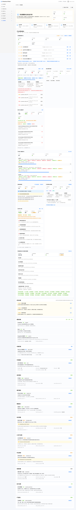

# 系统管理

## 用户管理

用户管理用于维护用户资料、角色、启停状态和外部身份绑定。

管理员可以查看：

- 用户登录名、显示名称、邮箱、手机号。
- 角色和账号状态。
- 登录方式、本地密码状态。
- 钉钉绑定企业和外部身份摘要。

停用、删除或降权管理员时，系统会保护最后一个 active admin，避免系统失去管理入口。

## 角色与菜单

角色管理维护权限点、数据范围和可分配角色。菜单管理维护页面入口。菜单可见不等于接口可写，后端权限点才是最终授权边界。

配置建议：

- 新增菜单时同步角色授权和帮助文档。
- viewer 角色保持只读，不授予写操作、审批或高风险动作。
- 排查“菜单可见但接口拒绝”时，在角色管理页输入用户 ID 运行“用户权限诊断”，同时查看“用户菜单视角预览”，确认实际可见菜单、被阻断菜单和缺失权限点。
- 调整角色菜单、权限点或数据范围前，先在授权弹窗运行“保存前风险预检”；若提示菜单权限缺口，需要按自动修复建议补齐权限点后再保存。
- 对比 read/write/admin scope 时优先查看“角色权限与范围预览”和预检结果，避免只给菜单入口而没有产品或知识空间数据范围。

## 系统健康

系统健康用于统一查看平台依赖、配置完整性、最近失败摘要和修复建议。管理员可以从“系统管理 / 系统健康”进入，也可以在页面右上角点击“查看本页帮助”打开对应手册。

页面重点：

- 总览区展示整体状态、检查项总数、正常项、需关注项和阻断异常。
- 平台治理运维台把运维重点拆成告警中心、AI 任务执行、知识质量、产品接入、权限诊断、钉钉授权、安全审计治理和帮助/归档策略八块。
- 告警中心会把异常检查项、产品接入低分和钉钉授权到期统一列出来，并标明建议处理人、处理状态、最近出现时间和跳转入口；管理员可直接点击“处理”认领、标记处理中、关闭或忽略告警，并填写关闭原因和复盘记录。
- 告警中心会展示启用规则数、规则摘要和历史趋势；管理员可在页面点击“新增规则”配置 `source`、`component`、最低严重级别、负责人和规则条件，也可以直接启用或停用已有规则。
- 点击“新增订阅”可以配置告警通知渠道、通知目标、最低严重级别和订阅范围，用于把打开告警推送给负责人或运维组。
- AI 任务执行运维台展示 Runner 可用数、排队任务、运行中任务、失败/死信/超时任务、待审批数、队列压力、失败原因分布和策略配置矩阵；策略矩阵会标明任务超时、租约回收、死信阈值、手动重试、手动取消和 Runner 心跳的配置来源、阈值范围和风险提示。
- 知识中心质量闭环展示文档可检索率、索引失败、待审核沉淀、无结果率、引用点击率、有用/无用反馈和 RAG 引用准确率 proxy；索引失败、仅关键词索引、无可检索分片或长期未更新的文档会进入“知识治理待办”，并展示严重级别、所属知识空间、最近更新时间和建议动作。
- 产品接入完整度评分按产品主数据、迭代版本、模块、代码仓库、可检索知识文档、关联系统、插件连接、产品权限范围和最近健康检查计算；插件测试失败、知识索引失败、权限范围缺失会在产品卡片里展示健康状态和摘要。
- 权限诊断增强区汇总菜单权限缺口、高风险角色、数据范围缺失、保存角色前风险预检、自动修复建议和 read/write/admin scope 对比，方便从“菜单能看但接口拒绝”的问题继续排查。
- 钉钉授权生命周期区展示钉钉登录配置、用户绑定、MCP 连接失败、URL Key 到期提醒，以及个人授权、系统授权、应用授权的边界说明和连接授权主体；每个钉钉连接会显示授权主体类型、企业名称或 CorpId、授权到期时间、剩余天数、测试状态和边界说明，便于统一管理个人/系统/应用授权。
- 帮助截图与数据归档策略区展示帮助截图覆盖情况，审计、执行链路、模型日志、作业运行、知识导入等保留天数，以及超过保留期的数据归档候选；对象存储同步清理会提示知识附件孤儿引用、对象信息不完整和清理失败数量。
- 安全审计治理区展示敏感配置变更数量、高风险操作数量、审计导出入口、管理员周报摘要、密钥引用校验和直接密钥配置数量；页面只展示状态和路径，不展示密钥值。
- 点击安全审计治理区的“周报”可以生成近 7 天管理员周报 Markdown，用于复盘告警、审计、高风险操作、知识质量和 AI 执行失败情况。
- 优先处理区聚合当前最需要修复的依赖、配置或运行失败，并支持跳转到对应配置页面。
- 分类检查覆盖 PostgreSQL、Redis、pgvector、MinIO/S3 对象存储、SMTP、钉钉登录、钉钉 MCP、模型网关、知识质量、AI 执行器、定时作业、观测告警和产品初始化。
- 快捷入口支持下钻到执行诊断、权限诊断、模型网关和插件运维。
- 帮助中心维护可运行 `node scripts/check_help_center_assets.mjs` 检查帮助路由、前端/Markdown 截图文件、截图过期状态和双份截图一致性；需要刷新截图时可先运行 `node scripts/capture_help_screenshots.mjs --list-targets` 查看自动派生目标，再使用 `READINESS_BEARER_TOKEN` 或 `--bearer-token` 运行 `node scripts/capture_help_screenshots.mjs`。

排查建议：

- 优先处理红色异常，再处理橙色或黄色待完善项。
- 产品接入分数低时，先补版本、模块、代码仓库和产品知识文档；如果健康摘要提示插件失败或知识索引失败，先重新测试插件连接或重建文档索引，再复检系统健康。
- 知识治理待办出现“索引未完成或失败”时，优先重新索引并查看导入/解析日志；出现“仅关键词索引”时，检查 Embedding/pgvector 配置并重建向量索引；出现长期未更新时，确认内容仍有效、更新文档或归档。
- AI 执行器出现死信、超时或队列压力升高时，先进入插件运维确认 Runner 在线和审批是否卡住。
- AI 执行策略出现需关注时，先执行“扫超时”释放过期租约，再复核任务 `timeout_seconds`、租约 `lease_timeout_seconds`、`max_reclaim_count` 和 Runner 心跳阈值是否过大或过小。
- 数据归档清理体检出现过期候选时，先导出审计或运行证据，再按保留策略归档或清理；对象存储出现孤儿引用或清理失败时，复核知识文档删除结果并补偿清理 MinIO/S3 对象。
- 看到 SMTP、钉钉、模型网关或插件异常时，先查看“最近错误”和“修复建议”，再进入对应配置页验证。
- 菜单可见但接口返回 `FORBIDDEN` 时，进入“权限诊断”按用户、菜单路径和权限点排查。

## 系统设置

系统设置用于维护系统基础配置和邮件发送能力。

### 邮件发送配置

需要配置：

- 系统管理员邮箱。
- 发件邮箱。
- 默认发件人。
- Reply-To。
- SMTP Host。
- SMTP 端口。
- SSL/TLS 加密方式。
- SMTP 用户名。
- SMTP 密码/授权码，或 SMTP 密钥引用。
- 测试收件人。

SMTP 密钥引用只用于引用外部密钥，例如 `env:SMTP_PASSWORD`。如果直接在“SMTP 密码/授权码”字段填写安全密码或客户端专用密码，可以不配置密钥引用。

首次配置或变更邮件发送配置时，页面会要求管理员二次确认；后端也会强制校验确认信息，避免绕过页面直接写入敏感配置。密码和授权码不会明文回显，审计只记录是否配置、变更字段和已确认状态，不记录密钥值。点击“发送测试邮件”前，页面会先保存当前表单配置，再调用测试发送接口。

## 模型网关

模型网关用于维护模型供应商、模型配置和调用元数据。业务模块应通过模型网关调用模型，不直接依赖供应商 SDK。

模型日志记录供应商、模型、用途、Token、延迟、状态和错误摘要，不默认保存完整提示词或完整输出。

## AI 助手管理配置

AI 助手快捷任务和 @ 能力用于控制不同角色能在助手里看到哪些快捷动作和能力引用。

配置时应写清：

- 适用角色。
- 输入要求。
- 风险等级。
- 输出去向。
- 是否需要人工确认。
