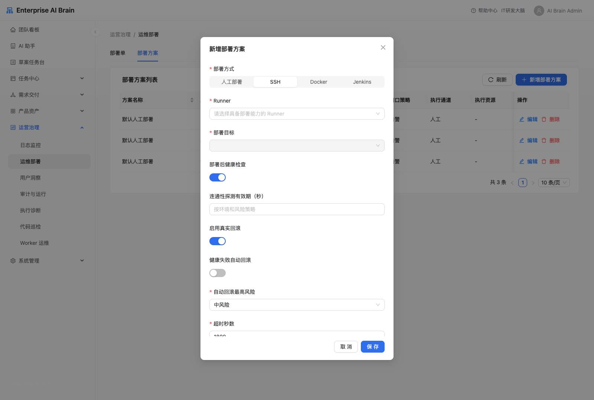

# 任务中心与运营治理

## 定时作业

定时作业用于管理周期性任务、手动触发任务并查看运行记录。

常用操作：

1. 在作业列表查看启停状态、下次运行时间、最近运行结果和产品归属。
2. 点击手动触发后，页面会切到运行记录并置顶展示新运行记录。
3. 失败时查看错误摘要、trace_id 和关联审计记录。

新增或编辑作业时，“数据来源”支持两种方式：

- 直接取数连接：适合用户反馈连接器、AI 客服聊天记录连接、HTTP API 等配置后可直接取数的连接。
- 授权连接 + 读取动作：适合钉钉文档 MCP、GitHub、GitLab、邮箱等授权型连接。先选择授权连接，再选择读取动作，并填写动作参数，例如钉钉文档读取的文档链接或 ID。

邮件通知类动作依赖系统设置中的邮件发送配置。

“同步钉钉文档”模板适合把客服聊天、用户反馈、需求风险、Bug、产品运营摘要或代码巡检摘要定期同步到团队的钉钉文档。建议配置顺序：

1. 数据来源选择“内部数据源”或已配置好的 AI 客服聊天记录、用户反馈、代码巡检、HTTP API 等连接。
2. AI 执行选择模型、AI角色和适配场景的 Skill；没有 Skill 时不会进入大模型汇总判断。
3. 结果动作默认保留“同步钉钉文档”。如果确实要把 AI 输出的高价值机会写入需求管理，可再增加“创建需求”动作。
4. 在同步钉钉文档动作里粘贴钉钉文档链接，例如 `https://alidocs.dingtalk.com/i/nodes/...`，系统会自动提取文档 ID。

运行后在运行详情里按三段查看结果：数据来源返回内容、AI 执行处理后的 `dingtalk_markdown`，以及钉钉文档写入反馈；如果配置了创建需求动作，还会展示需求写入结果。

“创建需求”结果动作只能把候选需求写入定时作业所属产品，AI 输出中的其他产品编号不会被接受。同一次运行因 Runner 重试或重复回调再次执行结果动作时，系统会复用已经创建的需求，避免重复登记。

## AI 能力配置

AI 能力配置用于维护可被任务、插件和助手调用的能力定义。配置时应写清能力名称、用途、输入输出、风险等级和适用角色。

高风险能力建议只开放给管理员或明确业务负责人。

## 插件管理

插件管理用于维护标准插件、授权配置、健康诊断、工具发现和动作模板。

新增插件后建议按以下顺序验证：

1. 完成授权配置。
2. 执行工具发现。
3. 运行健康诊断。
4. 绑定 AI 能力或任务模板。
5. 检查高风险动作的审计摘要是否脱敏。

GitHub、GitLab、Jenkins 和可观测性连接可声明 Webhook Secret 引用、允许事件、产品/版本/环境上下文和受控写回权限。外部系统应向连接模板给出的 `/api/integrations/webhooks/{provider}/{connection_id}` 地址发送事件；平台先验签和幂等入库，再由后台 Worker 投影 CI、PR/MR、发布或运行指标。插件页“外部事件”可查看最近 Delivery、处理状态、重试次数和脱敏上下文，只有失败或死信事件可以重试。

GitHub/GitLab 的评论、Review、request changes 或合并写回由平台 Outbox 执行，并同时校验连接写权限、产品仓库归属和质量门禁；连接中未显式允许的写动作不会执行。

钉钉官方 MCP 连接使用 URL Key 授权。新增钉钉文档、知识库、钉盘、AI 表格、机器人或通讯录连接时，优先从钉钉 AI Hub MCP 详情复制 `StreamableHttp URL` 或 JSON Config 中的 `url`，直接粘贴到连接的 `StreamableHttp URL` 字段；系统会自动提取 `key` 并在测试、动作调用和日志中脱敏。生产环境建议使用不带 `key` 的实例 URL，并在“URL Key / 密钥引用”中填写 `vault/...` 或 `env:...` 这类密钥引用。

新增动作时，钉钉官方场景统一以“钉钉能力 - 操作”命名，例如“钉钉文档 - 搜索文档”“钉钉文档 - 读取内容”“钉钉文档 - 创建文档”“钉钉文档 - 更新内容”。钉钉连接只表示授权入口，不直接绑定某一个文档；需要把用户洞察、巡检摘要或任务结果同步到已有钉钉文档时，选择“钉钉文档 - 更新内容”，并把“结果写入目标”切换为“钉钉文档”，在目标参数里填写钉钉文档链接或 ID、写入内容和追加/覆盖方式。可直接粘贴 `https://alidocs.dingtalk.com/i/nodes/...` 链接，系统会自动提取 `/i/nodes/` 后的文档 ID。

动作试运行默认会使用动作中已经保存的连接、文档、写入内容和追加/覆盖方式，通常保持默认输入 `{}` 后点击“试运行”即可。钉钉文档写入动作会自动使用真实 MCP 工具 `update_document`，并把页面里的钉钉文档链接和写入内容转换为 `nodeId`、`markdown`、`mode` 参数，不需要手工配置 `tool_name`；只有临时覆盖文档、写入内容或其他请求参数时，才展开“高级：临时覆盖输入 JSON”填写覆盖字段。

## 日志监控

日志监控用于查看代码、构建、发布和在线日志指标。异常波动应下钻到产品、版本、研发任务、代码巡检或发布记录确认根因。

## 运维部署

运维部署位于“运营治理 / 运维部署”，页面分为“部署单”和“部署方案”两个页签，两个列表均使用服务端分页、筛选和排序。先按产品和环境维护部署方案，再从测试完成或待发布需求发起部署单；部署单会保存当时的方案快照，后续修改方案不会改变已经创建的部署单。

## Worker 运维

“运营治理 / Worker 运维”用于查看平台后台执行状态：待处理事件、最长积压、超时租约、死信、重试次数和 Worker 最近心跳。页面同时列出外部操作的对账状态。

- 点击“执行对账”只会查询已处于 `unknown`、`reconciling` 或“待人工对账”的操作状态，不会重放部署、合并或写回动作。
- Runner 操作按幂等键核对对应任务；Jenkins 操作复用构建同步查询。无法安全确认的结果会保留为“待人工对账”。
- 死信、超时租约或长期无心跳时，应先确认 Worker 和 Provider 连接状态，再处理具体事件。

支持四种部署方式：

- 人工部署：启动后由发布/运维负责人手工登记成功、失败或回滚结果。
- SSH 部署：平台向具备“部署执行”能力的本地 Runner 下发任务，由 Runner 使用本机固定目标配置连接远端主机并执行部署命令。
- Docker 部署：平台向本地 Runner 下发任务，由 Runner 在预先配置的工作目录执行固定 Docker Compose 发布流程。
- Jenkins 部署：平台通过已启用的 Jenkins 连接触发指定 Job，并由后台同步器或页面“同步”操作更新队列、构建、取消和终态结果。

新增部署方案时选择产品、环境和部署方式，并配置全量、灰度、分批或蓝绿发布策略、部署窗口、健康检查和回滚策略。SSH/Docker 只接受处于“部署”信任域、在线、已上报目标且已完成真实连通性探测的 Runner；Jenkins 需要选择可用连接、填写部署 Job，以及可选健康检查/回滚 Job。缺少 Runner 目标、真实探测、执行资源授权或 Jenkins 连接时，方案表单会显示原因并提供跳转到对应配置页的入口。候选资源必须先在“系统管理 / 执行资源授权”中授权给对应产品和环境。Runner 主机地址、SSH 私钥、known_hosts、Docker 工作目录和真实命令只保存在 Runner 本地 `runner_config.json`，平台只保存受控引用。一个产品在同一环境只能有一个启用中的默认方案；需要停用或调整当前默认方案时，应先把同产品、同环境的其他方案设为默认。

部署 Runner 的“探测”会向 Runner 下发独立任务，而不是把心跳或目标上报当作连通证明：SSH 只使用固定参数连接后执行 `true`，Docker 只检查 Docker Engine 与 Compose 配置；两种探测均不拉镜像、不重启服务、不执行部署或回滚命令。Runner 同时上报本地目标配置的不可逆指纹；主机、目录、命令或目标配置变化后，历史探测会立即失效。探测有效期按环境和风险等级收紧，方案可进一步设置更短有效期；探测失败、超时、过期或配置变化时需要重新探测，平台会阻止新的 SSH/Docker 部署启动。

Jenkins 方案填写连接和 Job 后可直接执行预检。预检会使用配置连接请求 Jenkins API，并检查目标 Job 可读取；不展示或保存凭据明文。自动部署单的操作按钮为“探测并启动”：Runner 方案会等待本地探测结果，Jenkins 方案会立即执行 API/Job 预检，成功后才自动继续启动。没有通过时，部署单保持待运维执行。

发起部署时填写产品版本、待部署需求、环境、部署方案、风险等级、发布分支、Commit、制品版本/摘要、部署窗口和回滚方案。若当前产品和环境只有人工方案或没有任何方案，页面会明确提示并可跳转到部署方案配置。启动前平台会校验需求状态、阻塞 Bug、发布评估、严格时间窗口、制品完整性、执行资源授权、Runner/Jenkins 就绪和回滚配置；不满足时保持待执行并给出阻断项。点击“启动”后，人工部署进入执行中等待人工登记；SSH/Docker 和 Jenkins 由事务 Outbox 派发，租约、幂等键和完成回执用于避免重复领取。若外部系统已接收请求但平台未收到确定结果，系统保留待对账状态并要求查询或人工处理，不盲目重试。

高风险或严重级别的生产部署会自动生成变更控制单，必须由创建人之外的发布负责人和测试负责人分别确认后才能启动；产品发布冻结处于启用状态时，所有生产部署均会被阻断。外部派发出现连接中断、超时等无法确定远端是否已执行的情况时，平台将该操作标记为待对账，不会继续自动重试。

点击部署单“详情”可查看方案快照、前置质量门禁、发布波次、每次部署/验证/回滚运行、步骤证据、健康检查、统一日志、派发记录和审计。灰度、分批和蓝绿发布的每一波只有在方案要求的健康检查或冒烟证据通过后才进入下一波；缺失证据也视为不能推进。失败时按方案自动创建独立回滚运行，或进入人工接管。回滚不是把原部署记录改名，而是保留新的回滚证据。

如果 Jenkins 在触发前已停用，部署单会保持待执行；网络触发失败会记录为可重试失败，修复连接后可再次启动。Jenkins 返回的队列和构建地址必须与连接端点同源，系统不会把 Jenkins 凭据发送到其他地址。Jenkins 取消请求发送失败时会恢复为部署中并保留告警日志，可重新执行取消。

菜单需要 `deployment.read`；发起、执行、取消和维护方案分别需要 `deployment.create`、`deployment.execute`、`deployment.cancel` 和 `deployment.scheme.manage`。服务端同时按产品成员范围校验数据权限；只具备查看权限的用户可以查看授权产品的部署证据，但不会看到高风险操作按钮。

状态含义：

- “待运维执行”：部署单已创建，等待启动。
- “部署中”：已经启动部署，关联需求处于部署中；自动部署由 Runner 或 Jenkins 回写结果。
- “等待人工接管”：自动健康检查或回滚遇到不能安全继续的问题，等待运维处理。
- “取消中”：已经向 Runner 或 Jenkins 请求取消，等待外部执行通道确认终态。
- “部署成功”：关联需求进入已发布。
- “部署失败 / 已回滚”：关联需求回到待发布，并生成部署失败来源的 Bug。
- “已取消”：未完成部署已经终止，部署中的需求回到待发布。

## 执行资源授权

执行资源授权位于“系统管理 / 执行资源授权”，由系统管理员把 Runner Target 或 Jenkins Connection 授权给指定产品和环境。授权记录支持启用/停用和版本冲突保护。

- 授权列表会显示资源是否已就绪，并区分 Runner 未启用、未在线、未启用部署能力、非部署信任域、目标未上报、未完成真实探测、探测失败、探测过期或目标未就绪等状态。
- 产品发布负责人只能查看和绑定当前产品、当前环境已授权的资源，不能枚举其他产品的生产目标。
- Runner Target 授权同时固定 `runner_id + target_code`；Jenkins 授权固定连接 ID，真实主机、凭据和命令仍不进入授权记录。
- 撤销授权会阻止新方案绑定和新部署启动，但不会篡改历史部署单保存的方案快照与审计证据。

## 用户洞察

用户洞察用于沉淀用户反馈、行为指标和迭代建议。负向反馈可以进入治理视图，并关联到迭代建议、需求或 Bug。

## 审计与运行

审计与运行用于查询关键操作、接口异常、权限拒绝和高风险 AI 动作。

常用操作：

1. 按事件类型、主体、操作者和结果筛选审计记录。
2. 点击“详情”查看脱敏 payload，确认变更字段、主体和结果。
3. 点击“链路追踪”查看审计主体关联的需求、任务、Bug、反馈或产品上下游。
4. 点击“执行诊断”查看该审计事件关联的运行 Trace。
5. 点击“导出 CSV”会按当前筛选和排序导出最近 1000 条审计摘要；导出内容不包含密钥、完整 Prompt 或大段业务正文。

排障时优先收集：

- 用户操作时间。
- 页面路径。
- 错误码。
- trace_id。
- 业务主体类型和 ID。

## 执行诊断

执行诊断用于查看 AI 任务、审计事件、代码巡检等执行链路。任务卡住、写回失败或接口异常时，优先从执行诊断查看运行节点、输入摘要、输出摘要和失败原因。

## 代码巡检

代码巡检用于按产品查看质量安全巡检报告、风险分布和治理待办。

页面重点：

- 顶部产品范围会联动报告列表、风险分布和治理概览。
- 未关联需求上下文的独立巡检报告不会直接打开需求全链路。
- 严重发现建议先进入 Bug 或需求确认，再推进 AI 研发任务。
