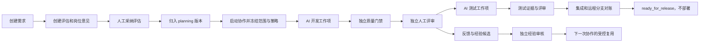

# 研发协同真实全链路测试设计

**日期：** 2026-07-26  
**状态：** 已确认，待实现  
**范围：** 需求驱动研发协同 v2.0 的真实本地全链路验证；不包含部署。

## 1. 目标与边界

验证 AI Brain 能在真实本地环境中，从一条产品需求完成评估、规划、AI 协同、Runner 执行、质量门禁、人工评审、远程 Git 测试分支推送、经验沉淀和受控复用，并在 `ready_for_release` 终止。

本方案的通过不代表发布或部署成功。测试严禁：

- 合并到开发、主干或发布分支；
- 调用部署 API、创建部署单或改变部署环境；
- 用客户端直接创建、启动、重试或取消 v2 协作 AI 任务；
- 伪造远程提交、质量门禁或人工评审证据。

与产品缺陷修复分离：缺陷修复继续留在当前开发分支；测试执行只能在平台原生隔离分支 `rd/<run-id>/<work-item-id>` 及其 Runner 隔离 worktree 中写入。测试需求、产品和运行统一带 `e2e` 标识，远程分支仍遵循服务端冻结的原生交付契约。

## 2. 测试策略

采用分层方案，而非只依赖单一黑盒流程。

| 层级 | 目标 | 方式 | 是否使用真实 Runner |
| --- | --- | --- | --- |
| L1 状态机与契约 | 验证 API、权限、幂等、状态迁移和错误码 | pytest 与公开 API 回归 | 否 |
| L2 控制面回归 | 验证需求评估、策略快照、版本归组、DAG、独立评审 | `full_chain_regression_rd_collaboration.py` | 否 |
| L3 Runner 可靠性 | 验证心跳、租约、取消、重试和超时治理 | `full_chain_regression_runner.py` 与单元测试 | 模拟 Runner 协议 |
| L4 真实交付链路 | 验证 worktree、真实执行、质量门禁、远程分支和对账 | 独立 E2E Runner 用例 | 是 |
| L5 浏览器验收 | 验证迭代总览、任务详情、人工确认入口和可读性 | 本地 Web + PostgreSQL API 浏览器测试 | 间接 |

L1--L3 是 L4 的快速定位层，不能代替 L4。L4 成功后才可以宣称最小真实研发链路跑通；L5 通过后才能宣称该链路可由研发团队在页面上操作。

## 3. 环境、身份与分支隔离

### 3.1 执行前置条件

1. PostgreSQL API、Web、执行 Worker 与至少一个 Codex Runner 健康可用。
2. Runner 已绑定 active AI 执行器策略、AI 数字员工和允许的研发岗位；执行容量至少为 1。
3. 测试仓库已绑定统一研发执行策略，并允许专用 Git 写回身份只对 `rd/*` 推送；测试运行只能生成 `rd/<run-id>/<work-item-id>` 原生隔离分支。
4. 冻结策略的 `delivery_target` 是 `ready_for_release`，部署能力保持关闭。
5. 可执行人、评审人和经验审核人是不同主体；服务账号、AI 数字员工、Runner 与人类岗位分别记录。

### 3.2 测试主体

| 主体 | 职责 | 不得承担的职责 |
| --- | --- | --- |
| 产品负责人 | 创建需求、采纳评估、启动协作 | 审批自己产生的 AI 证据 |
| AI 开发员工 | 修改测试分支中的最小研发产物 | 自己审批产物 |
| AI 测试员工 | 执行规定测试并提交结构化证据 | 审批开发或测试证据 |
| 集成岗位 | 推送测试分支、生成 Git 对账证据 | 推送非测试分支 |
| 独立评审人 | 审批工作项、处理暂停决策 | 作为被审核证据的生产者 |
| 经验审核人 | 批准、驳回或退役经验候选 | 审核自身来源证据 |

### 3.3 最小真实任务

测试需求固定为低风险、可重复的代码库变更：在测试分支创建一份研发协同验证文档，内容必须包含 `requirement_id`、`run_id`、验收条件和 `trace_id`，随后执行项目规定的校验命令。

该任务必须真实经历 checkout、隔离 worktree 写入、提交、质量门禁和远程推送；不能以 mock 提交或手工填写 SHA 替代。文档变更限制了风险与清理成本，同时仍覆盖 AI 研发执行的关键副作用。

## 4. 主链路设计

### 4.1 工作项 DAG

| 工作项 | 负责人 | 依赖 | 风险 | 完成定义 |
| --- | --- | --- | --- | --- |
| `implement_e2e_artifact` | AI 开发员工 | 无 | low | 在隔离 worktree 创建测试产物并产生本地提交；质量门禁通过；独立评审批准。 |
| `verify_e2e_artifact` | AI 测试员工 | `implement_e2e_artifact` | low | 使用标准 `automated_testing` 类型执行冻结测试命令，提交测试证据并形成集成交付分支；质量门禁和独立评审通过后保存 local/remote SHA、Outbox 与远程对账证据。 |

低风险 AI 工作项由 Worker 自动派发；高风险测试变体先创建人工派发决策。任何人工确认通过后，Worker 通过持久化状态和 outbox/event 处理扫描可执行工作项，并非靠页面轮询推进。Git push 由可信交付 Outbox 创建冻结 Runner 任务，不由用户直接提交远程 SHA。

两个工作项完成后，平台交付证据校验器检查实现与自动化测试两类可信 Git 交付、门禁和评审证据，随后推进到待发布；它不是可由用户领取的第三个工作项。

### 4.2 主链路测试用例

| ID | 场景 | 前置 | 操作 | 关键断言 | 级别 |
| --- | --- | --- | --- | --- | --- |
| E2E-01 | 环境与策略预检 | 服务已启动 | 查询健康、Runner、策略和岗位绑定 | 策略可解析、Runner 在线、部署关闭、Git 范围受限 | P0 |
| E2E-02 | 需求评估和规划归组 | 产品与 planning 版本存在 | 创建需求、评估、岗位意见、人工 `accept` | 评估及 final 策略快照不可变；需求归入兼容 planning 版本 | P0 |
| E2E-03 | 协作规划和冻结 | E2E-02 通过 | 启动协作并生成/提交计划 | `scope_version`、需求修订、策略快照、岗位席位和 DAG 冻结；DAG 无环 | P0 |
| E2E-04 | AI 自动派发 | 开发工作项 ready | 触发/等待 Worker 周期 | 生成 AI task、attempt、Runner task；工作项进入 running，无人工开始动作 | P0 |
| E2E-05 | Runner 真实开发 | E2E-04 通过 | Runner 执行最小任务 | 存在隔离 worktree、执行日志、本地 commit、产物内容和 trace 关联 | P0 |
| E2E-06 | 质量门禁和独立评审 | 开发执行完成 | 等待门禁，评审人批准 | 门禁 passed 后工作项 `reviewing`；批准后 `completed`，产生反馈归因 | P0 |
| E2E-07 | 依赖自动解锁 | E2E-06 通过 | 等待 Worker 调度测试工作项 | 测试工作项由 blocked/ready 自动进入 running；不需手工推进 | P0 |
| E2E-08 | 真实远程交付 | 实现与自动化测试证据获批 | 等待两类交付 Outbox、Runner push 和对账 | 远程仅新增原生隔离分支；local/remote SHA 一致；实现与自动化测试可信交付记录齐全 | P0 |
| E2E-09 | 待发布收口 | 测试与 Git 证据齐全 | 执行交付证据校验 | 版本 `ready_for_release`；运行 `completed` 且原因为 `ready_for_release`；部署记录为零 | P0 |
| E2E-10 | 页面操作验收 | E2E-02 至 E2E-09 有记录 | 浏览器访问版本总览、任务详情 | 可查看 DAG、执行状态、门禁、Git 证据、阻塞项；待确认项提供可操作确认入口 | P0 |

## 5. 异常、返工和治理用例

| ID | 场景 | 操作 | 预期结果 | 级别 |
| --- | --- | --- | --- | --- |
| E2E-11 | 高风险派发门禁 | 创建 high 风险自动化测试变体 | 运行/工作项暂停在 `waiting_human`，批准后才创建 Runner 任务 | P0 |
| E2E-12 | 质量门禁失败返工 | 返回失败质量结果 | 保留失败证据；进入返工；新 attempt 与旧 attempt 严格分离 | P0 |
| E2E-13 | 取消和迟到结果围栏 | 取消运行中的工作项，再提交迟到完成结果 | `cancel_requested → cancelled`；迟到结果仅审计，不得恢复工作项或创建门禁 | P0 |
| E2E-14 | Runner 超时恢复 | 触发冻结超时预算 | 生成 `runner_timeout_recovery` 决策；保留 worktree；人工恢复后新建 attempt | P0 |
| E2E-15 | 幂等和乐观锁 | 重复启动、确认、提交或使用旧版本号评审 | 同一幂等键不重复副作用；旧版本返回稳定冲突错误 | P1 |
| E2E-16 | 部署防护 | 在待发布策略下尝试部署入口 | 拒绝或不创建部署记录；不改变版本/运行为 deploying | P0 |
| E2E-17 | Runner 健康与租约 | 模拟心跳过期、断连、取消重试 | 诊断、租约、重试和审计完整；不遗失 attempt 归因 | P1 |

## 6. 经验沉淀与受控复用

经验复用不阻塞 P0 交付成功，但必须验证其闭环。

1. 由已完成工作项的审核结论、返工原因和门禁证据生成 `pending` 经验候选。
2. 独立经验审核人将候选决定为 `approved`、`rejected` 或 `retired`。
3. 再创建一条相同仓库信任域、同类岗位和兼容策略的测试需求。
4. 只有平台能力标志及冻结策略 `experience_reuse_config` 同时允许，且风险、置信度、容量、策略版本、仓库/工具信任域满足条件时，批准经验才可被引用。
5. 验证经验引用保留来源证据和版本，且不会自动改写生产策略；关闭能力标志或不满足信任域时，经验必须不注入。

| ID | 场景 | 断言 | 级别 |
| --- | --- | --- | --- |
| E2E-18 | 候选生成与独立审核 | 候选、来源反馈、审核主体、版本和状态可追溯 | P1 |
| E2E-19 | 允许复用 | 新运行的岗位上下文包含受控经验引用与证据 ID | P1 |
| E2E-20 | 禁止复用 | 能力、策略、风险或信任域任一不满足时，不返回经验内容 | P1 |

## 7. 取证、通过和退出标准

每次执行使用唯一 `run_id` 和 `trace_id`，并保留：

- 需求修订、评估、策略快照、版本范围快照和 DAG；
- 每个工作项、attempt、AI task、Runner task、质量门禁和人工 Review 的 ID、版本与状态时间线；
- 脱敏 Runner 日志、工作区标识、执行器和 Worker 心跳；
- 测试分支、local/remote commit SHA、Outbox、远程对账和可信交付记录；
- 浏览器截图：版本总览、任务详情、人工确认、经验审核与最终状态；
- 审计事件和经验复用引用。

P0 主链路通过必须同时满足：

1. 真实 Runner 生成并提交测试产物，且远程测试分支可对账；
2. 所有必需工作项、质量门禁和独立评审完成；
3. 协作运行以 `completion_reason=ready_for_release` 完成，产品版本为 `ready_for_release`；
4. 不存在部署单、部署 Runner 任务或部署审计事件；
5. 页面能展示状态和下一步人工操作，且没有相关控制台/运行时错误。

测试分支、worktree 和业务记录默认保留至证据验收完成；它们以 `e2e` 标签隔离，后续只能按保留策略归档或清理，不能在用例结束时删除审计证据。

## 8. 实施顺序

1. **迁移回归基线。** 修复旧 `full` / `all-targeted` 回归中直接调用旧需求审批接口的部分，统一改走评估、组版和协作状态机；不得降低 `REQUIREMENT_ASSESSMENT_REQUIRED` 守卫。
2. **建立 E2E fixture。** 配置测试产品、独立人类评审身份、AI 员工、执行器、Runner、测试仓库和受限分支规则。
3. **实现主链路自动化。** 新增 L4 用例，使用真实 Runner、独立测试分支及明确的等待超时和取证目录。
4. **补齐异常路径。** 覆盖质量失败、取消围栏和超时恢复，复用同一持久化模型而非 mock 状态。
5. **浏览器验收。** 使用 PostgreSQL API 运行时登录产品负责人和独立评审人，验证总览与确认流程。
6. **经验闭环。** 在 P0 稳定后开启 P1 经验审核与二次受控复用验证。

## 9. 已知基线与风险

- 已有研发协作控制面和 Runner 可靠性回归可作为 L2/L3 基线，但不能替代真实远程交付。
- 现有旧 `full` 回归仍含已被 v2 正确阻断的旧审批调用，因此当前不能以“全量回归通过”宣称全链路完成。
- 真实 Runner 测试会受模型执行时长、网络、远程 Git 凭据和本地容量影响；测试脚本须使用事件/状态等待和明确超时，不得以页面轮询或固定短 sleep 作为完成判断。
- 任何测试失败均保留 run、attempt、worktree 和证据，以便按工作项恢复或返工，而不是删除后重跑。
